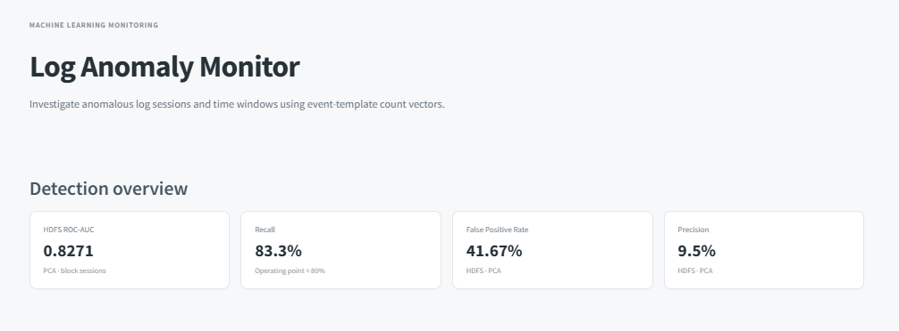

# Log Anomaly Detector

### Session-Based & Window-Based Log Anomaly Detection on HDFS and BGL

An end-to-end machine learning project for detecting anomalous system log behavior using **Drain log parsing**, **event-template representations**, **Isolation Forest**, and **PCA reconstruction error**.

The project investigates a central question in log monitoring:

> **How does the way we group log events into sessions or time windows affect anomaly detection performance?**

Instead of treating every log line independently, the system transforms raw logs into structured sessions or time windows and evaluates their anomaly scores using operational metrics such as **ROC-AUC, precision, recall, false-positive rate, and alert volume**.

---

## Table of Contents

- [Overview](#overview)
- [Objectives](#objectives)
- [Datasets](#datasets)
- [Methodology](#methodology)
- [Anomaly Detection Models](#anomaly-detection-models)
- [Evaluation Strategy](#evaluation-strategy)
- [Results](#results)
- [Key Findings](#key-findings)
- [Streamlit Dashboard](#streamlit-dashboard)
- [Project Structure](#project-structure)
- [Installation](#installation)
- [Running Tests](#running-tests)
- [Quick Demo](#quick-demo)
- [Downloading the Real Datasets](#downloading-the-real-datasets)
- [Running the Real Experiment](#running-the-real-experiment)
- [Kaggle](#kaggle)
- [Reproducibility](#reproducibility)
- [Generated Reports](#generated-reports)
- [Limitations](#limitations)
- [Future Work](#future-work)
- [Technologies](#technologies)
- [Author](#author)
- [License](#license)

---

## Overview

Modern systems can generate millions of log lines, making manual inspection impractical. This project implements a complete anomaly detection pipeline:

```
Raw Logs
   │
   ▼
Drain Log Parsing
   │
   ▼
Event Templates
   │
   ▼
HDFS Sessions / BGL Time Windows
   │
   ▼
Event-Template Count Vectors
   │
   ▼
Isolation Forest + PCA
   │
   ▼
Anomaly Scores
   │
   ▼
Operational Evaluation
   │
   ▼
Streamlit Monitoring Dashboard
```

---

## Objectives

The project has four main objectives:

1. Parse large-scale system logs into reusable event templates.
2. Transform raw log lines into meaningful sessions or time windows.
3. Compare classical unsupervised anomaly detection approaches.
4. Study how the definition of a sequence/window affects detection quality and alert volume.

A key idea of the project is that **the unit being classified matters**:

- For **HDFS**, the natural unit is a block session.
- For **BGL**, the project evaluates several time-window definitions: `30s`, `60s`, `300s`.

---

## Datasets

The experiments use the [LogHub](https://github.com/logpai/loghub) HDFS and BGL datasets.

### HDFS

| Property | Value |
|---|---|
| Log lines | ~11,175,629 |
| Grouping unit | Block ID → block-level sessions |
| Labels | Normal / Anomaly (block level) |

### BGL

| Property | Value |
|---|---|
| Log lines | ~4,747,963 |
| Grouping unit | Fixed time windows: `30s`, `60s`, `300s` |
| Labels | Derived from the dataset's alert field |

**Dataset sources:**
- LogHub: https://github.com/logpai/loghub
- Zenodo: https://zenodo.org/records/3227177

> Raw datasets are **not included** in this repository due to their size. They are downloaded locally when running the real experiments.

---

## Methodology

### 1. Drain Log Parsing

Raw system logs contain both stable event information and variable values such as IDs, numbers, IP addresses, timestamps, and other dynamic parameters. A Drain-style parser identifies recurring patterns and converts raw messages into **event templates**.

**Example:**

```
Original log:
Block blk_12345 moved from node 192.168.1.20

Event template:
Block <*> moved from node <*>
```

This reduces the raw log vocabulary into a structured set of event types.

### 2. Session and Window Construction

**HDFS** — logs are grouped by Block ID:

```
Log Lines → Block ID → HDFS Session
```

Each block session becomes one observation for anomaly detection.

**BGL** — logs do not use a block-based session structure. Instead, they are grouped by timestamp:

```
BGL Logs → Timestamp → 30s / 60s / 300s Windows
```

Different window sizes are evaluated to understand how temporal grouping affects anomaly detection.

### 3. Feature Engineering

Each session/window is represented as an **event-template count vector**:

| Template | Occurrences |
|---|---|
| Template A | 12 |
| Template B | 4 |
| Template C | 0 |
| Template D | 8 |

The vector represents the behavioral profile of the session/window. This representation is intentionally simple and interpretable.

---

## Anomaly Detection Models

Two unsupervised anomaly detection approaches are evaluated.

### Isolation Forest

Identifies observations that are easier to isolate from the rest of the dataset. Used as an unsupervised baseline for detecting unusual combinations of event-template frequencies. Does not require anomaly labels as direct training targets.

### PCA Reconstruction Error

Learns a lower-dimensional representation of the event-template vectors; reconstruction error is used as the anomaly score.

```
Original Vector → PCA → Compressed Representation → Reconstruction → Reconstruction Error → Anomaly Score
```

A higher reconstruction error indicates a stronger deviation from the learned structure.

---

## Evaluation Strategy

The project intentionally does **not** use accuracy as the headline metric — log anomaly datasets can be highly imbalanced, so accuracy can hide important operational behavior. Instead, the project reports:

- ROC-AUC
- Precision
- Recall
- False Positive Rate (FPR)
- Alerts per million lines
- Performance under alert budgets
- Performance at ~80% recall

The ~80% recall operating point is used to expose the trade-off between detecting anomalies and generating false alerts.

---

## Results

Results below come from the full real LogHub experiment using the complete HDFS and BGL datasets.

### HDFS Results

At an operating point targeting ~80% recall:

| Model | ROC-AUC | Precision | Recall | FPR | Alerts / 1M lines |
|---|---|---|---|---|---|
| Isolation Forest | 0.9607 | 44.54% | 80.91% | 3.04% | 2,736.61 |
| **PCA** | **0.9895** | **93.72%** | 80.10% | **0.16%** | **1,287.62** |

The HDFS experiment shows strong separation using PCA reconstruction error with block-level sessions.

### BGL Results

BGL is more challenging for the current event-template count representation.

**PCA — Window Size Comparison**

| Window Size | ROC-AUC | Precision | Recall | FPR |
|---|---|---|---|---|
| 30s | 0.8276 | 15.97% | 79.72% | 23.34% |
| 60s | 0.8371 | 15.58% | 80.00% | 22.24% |
| 300s | 0.8433 | 16.54% | 80.16% | 24.35% |

**Isolation Forest — Window Size Comparison**

| Window Size | ROC-AUC |
|---|---|
| 30s | 0.5235 |
| 60s | 0.6171 |
| 300s | 0.7646 |

BGL results show that the current count-vector representation struggles to control false positives when operating around 80% recall. This limitation is explicitly reported rather than hidden behind a single accuracy value.

---

## Key Findings

### HDFS

The HDFS experiment benefits from a natural session definition based on Block ID. At the selected operating point, PCA achieves:

- **ROC-AUC:** 0.9895
- **Precision:** 93.72%
- **Recall:** 80.10%
- **FPR:** 0.16%

This demonstrates that combining block-level sessions with PCA reconstruction error provides strong anomaly separation on HDFS.

### BGL

BGL is more difficult because logs are grouped into fixed time windows rather than naturally defined sessions. Changing the window size affects:

- anomaly score distributions
- alert volume
- false-positive behavior
- ROC-AUC

Sequence/window construction is therefore an important part of the anomaly detection problem.

---

## Streamlit Dashboard

The project includes an interactive Streamlit monitoring interface called **Log Anomaly Monitor**, built around three workflows.

### 1. Overview

- HDFS performance metrics
- Model comparison
- BGL window-size analysis
- Interpretation of HDFS and BGL results
- Detection pipeline diagram

### 2. Alert Triage

- Select a BGL window size
- Filter anomaly/normal windows
- Inspect high-scoring windows
- View anomaly scores
- Inspect raw log lines associated with a window

```
Anomaly Score → Flagged Window → Raw Log Lines → Human Inspection
```

### 3. Live Analysis

Upload a BGL-style `.log` or `.txt` file:

```
Uploaded Log → Drain Parsing → Event Templates → 60-Second Windows → Window Statistics
```

Displays:
- Number of parsed events
- Number of discovered templates
- Number of generated windows
- Alert statistics
- Window-level information
- Parsed templates

**Run the dashboard:**

```bash
python main.py dashboard
```

### Dashboard Screenshots

| Overview | Alert Triage | Live Analysis |
|---|---|---|
|  |  |  |

---

## Project Structure

```
log-anomaly-detector/
│
├── main.py
├── requirements.txt
├── README.md
├── LICENSE
├── .gitignore
│
├── logad/
│   ├── config.py
│   ├── download.py
│   ├── pipeline.py
│   ├── synthetic.py
│   │
│   ├── parsing/
│   │   ├── drain.py
│   │   ├── hdfs.py
│   │   └── bgl.py
│   │
│   ├── sequences/
│   │   ├── hdfs_sessions.py
│   │   └── bgl_windows.py
│   │
│   ├── features/
│   │   └── count_vector.py
│   │
│   ├── models/
│   │   └── detectors.py
│   │
│   ├── evaluation/
│   │   ├── metrics.py
│   │   └── window_study.py
│   │
│   └── viz/
│       └── plots.py
│
├── dashboard/
│   └── app.py
│
├── tests/
│   ├── test_bgl_windows.py
│   ├── test_hdfs.py
│   └── test_metrics.py
│
├── reports/
│   ├── metrics.csv
│   ├── figures/
│   │   ├── window_size_tradeoff.png
│   │   ├── alert_volume.png
│   │   └── fpr_at_80_recall.png
│   │
│   └── screenshots/
│       ├── overview.png
│       ├── alert-triage.png
│       └── live-analysis.png
│
├── kaggle/
│   ├── KAGGLE.md
│   └── kaggle_notebook.ipynb
│
└── data/
    └── README.md
```

> Large datasets, generated artifacts, caches, and virtual environments are intentionally excluded from version control.

---

## Installation

### Windows

```bash
python -m venv .venv
.venv\Scripts\activate
pip install -r requirements.txt
```

### macOS / Linux

```bash
python -m venv .venv
source .venv/bin/activate
pip install -r requirements.txt
```

---

## Running Tests

```bash
python -m pytest -q
```

---

## Quick Demo

A lightweight synthetic demo is available to verify that the pipeline works without downloading the complete datasets:

```bash
python main.py demo
```

> The demo is intended for testing the pipeline only. Synthetic demo metrics should **not** be presented as the real benchmark results.

---

## Downloading the Real Datasets

```bash
python main.py download --datasets hdfs bgl
```

Raw datasets are stored locally and excluded from Git via `.gitignore`.

---

## Running the Real Experiment

Run the complete BGL window-size experiment:

```bash
python main.py run --windows 30 60 300
```

For a smaller smoke test:

```bash
python main.py run --max-lines 200000 --windows 60
```

Generated evaluation results are written to `reports/metrics.csv`, and generated figures to `reports/figures/`.

---

## Kaggle

The full experiment was executed on Kaggle because the complete HDFS and BGL datasets contain millions of log lines.

**Recommended workflow:**

```
Kaggle Notebook → Install requirements → Download LogHub datasets → Run full experiment → Save metrics and figures
```

The repository contains the Kaggle workflow under `kaggle/`. Kaggle is recommended for the full experiment when local hardware, RAM, storage, or execution time is limited.

---

## Reproducibility

The main configuration is centralized in `logad/config.py`:

| Setting | Value |
|---|---|
| Random seed | 42 |
| PCA variance | 0.90 |
| Isolation Forest estimators | 200 |
| BGL windows | 30 / 60 / 300 seconds |

This makes the experiments easier to reproduce and modify.

---

## Generated Reports

- Main evaluation results: `reports/metrics.csv`
- Visualizations: `reports/figures/`
  - `window_size_tradeoff.png`
  - `alert_volume.png`
  - `fpr_at_80_recall.png`

These files summarize the completed real-data experiment.

---

## Limitations

### 1. Event order is not explicitly modeled

The current feature representation uses event-template counts. Sequences such as `A → B → C` and `C → B → A` can produce similar count representations — the system does not explicitly model event ordering.

### 2. BGL false positives

BGL results show a relatively high false-positive rate at the ~80% recall operating point, indicating that the current count-vector representation is not sufficient for highly precise BGL anomaly detection.

### 3. Classical unsupervised models

The current implementation focuses on Isolation Forest and PCA reconstruction error. More advanced sequence models could potentially capture temporal dependencies that these approaches miss.

---

## Future Work

- **Sequence-Aware Detection** — DeepLog-style next-event prediction, sequence embeddings, lightweight Transformer models
- **Temporal Features** — inter-arrival times, burst statistics, event frequency changes, temporal entropy
- **Streaming Processing** — streaming Drain/Drain3 processing for continuously arriving logs
- **Explainability** — show which event templates contributed most to an anomaly score
- **Additional Datasets** — evaluate the pipeline on additional system-log datasets to study generalization

---

## Technologies

Python · Pandas · NumPy · Scikit-learn · Matplotlib · Streamlit · Pytest · Drain-style log parsing · PCA · Isolation Forest · Kaggle

> Large raw datasets are downloaded when needed.


---

## License

This project's code is released under the **MIT License**.

The HDFS and BGL datasets are not included in this repository and remain subject to their respective source and distribution terms.
